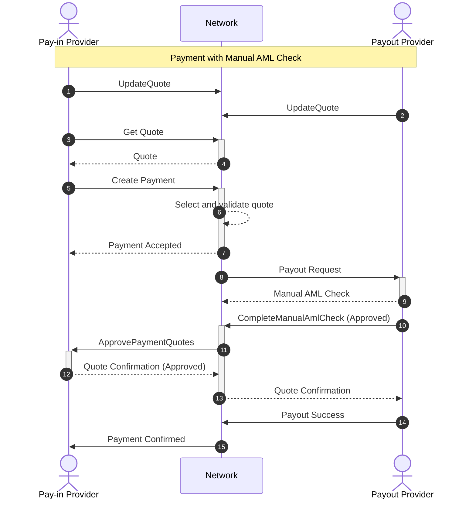

This flow describes the payment process when the Payout Provider requires additional Anti-Money Laundering (AML) verification before proceeding with the payout. This is an extension of the standard payment flow that introduces a manual review step and a quote confirmation mechanism.

Cross-border payments carry inherent compliance risks, as funds move between different regulatory jurisdictions with varying AML requirements. While most transactions pass through automated compliance checks, certain payments trigger additional scrutiny based on factors such as transaction amount, sender/recipient profiles, geographic risk indicators, or unusual patterns. The manual AML check flow ensures that Payout Providers can fulfill their regulatory obligations by conducting thorough compliance reviews when needed, without forcing an immediate accept/reject decision. This flow is essential for maintaining regulatory compliance while preserving the ability to complete legitimate transactions that require human review. Without this mechanism, providers would be forced to either reject all flagged transactions outright or accept compliance risk by proceeding without proper review.

&nbsp;

## Manual AML flow Description

### 1. UpdateQuote (Pay-in Provider)
Pay-in Provider streams exchange rate quotes to the Network at a cadence of their choosing, indicating rates at which they are willing to convert local currency to USDT for pay-ins. Quotes include rates for all supported currencies across standard volume bands ($1K, $5K, $10K, $25K, $250K, $1M). See [Quote management](../quote-management) for the publishing contract.

### 2. UpdateQuote (Payout Provider)
Payout Provider streams exchange rate quotes to the Network at a cadence of their choosing, indicating rates at which they are willing to convert USDT to local currency for payouts. Continuous streaming keeps rates fresh and doubles as a liveness signal.

### 3. Get Quote
Pay-in Provider requests a quote for a specific payment, specifying the amount (either in settlement currency USD or payout currency) and target currency. The request initiates the payment flow.

### 4. Quote Response
Network searches the order book for the best available quote that satisfies the required volume. Selection considers both rate competitiveness and available credit limit capacity between counterparties. Response includes the local currency amount, USDT settlement amount, and quote ID. Average latency: 20-50 milliseconds.

### 5. Create Payment
Pay-in Provider creates a payment using the quoted rate within the 30-second validity window. The request includes recipient details, bank account information, and comprehensive travel rule data (sender/recipient KYC information) following the OpenVASP standard with additional custom fields.

### 6. Select and Validate Quote
Network validates the quote is still valid, converts the payout amount to USD equivalent, and verifies sufficient credit limit exists between the counterparties for this transaction. If the best rate provider has insufficient credit capacity, the system automatically routes to the next best available quote.

### 7. Payment Accepted
Network confirms the payment request is accepted and will be routed to the selected Payout Provider.

### 8. Payout Request
Network sends payout instruction to the Payout Provider including: amount in local currency, USDT settlement amount, quote ID, recipient bank account details, and complete travel rule data for compliance validation.

### 9. Manual AML Check Response
Instead of immediately accepting or rejecting the payout, the Payout Provider responds indicating that a manual AML check is required. This signals that the transaction requires additional Anti-Money Laundering review by the Payout Provider's compliance team before the payout can proceed. The payment enters a pending state while the review is conducted.

### 10. CompleteManualAmlCheck (Approved)
After completing the manual AML review, the Payout Provider calls the Network to report the result. When approved, finds the latest quote from the Payout Provider for the payment, since the original quote may have expired during the AML review period. The Network then initiates the quote confirmation process with the Pay-in Provider. The updated settlement/payout amounts and new quote details are only returned to the Payout Provider after the Pay-in Provider approves the new rates.

### 11. ApprovePaymentQuotes (Quote Confirmation Request)
Network sends the updated quote details to the Pay-in Provider for approval. This "Last Look" mechanism allows the Pay-in Provider to verify and approve the final rates before the payment is executed. This is important because the exchange rate may have changed during the time the manual AML check was being performed.

### 12. Quote Confirmation Response
Pay-in Provider responds with approval or rejection of the updated quotes. If approved, the Payout Provider is authorized to proceed with the payout at the confirmed rates. If rejected (for example, due to unfavorable rate changes during the AML delay), the payment is cancelled.

### 13. Quote Confirmation to Payout Provider
Network relays the Pay-in Provider's quote confirmation to the Payout Provider, authorizing them to proceed with the payout at the agreed rates.

### 14. Payout Success
Payout Provider completes the local currency disbursement through domestic payment rails (bank transfer, IBAN, ACH, SEPA, mobile wallet, or other local payment methods) and reports completion to the Network, including payment receipt details and transaction IDs where available by local rails.

### 15. Payment Confirmed
Network notifies Pay-in Provider that the payout has been successfully completed. Network charges both providers a fee of 5 basis points (0.05%) from the USD equivalent of the transaction amount, recorded in the accounting ledger. Total network fee is 10 basis points (0.10%) per complete transaction.

## Key Differences from Standard Payment Flow

1. **Manual AML Review**: The Payout Provider can signal that additional compliance review is needed before proceeding, rather than immediately accepting or rejecting.

2. **Quote Refresh**: Since the manual AML check may take time (potentially longer than the 30-second quote validity window), the Network finds the latest quote from the Payout Provider after AML approval.

3. **Last Look Mechanism**: The Pay-in Provider gets a final opportunity to approve or reject the updated rates before the payout proceeds, protecting them from adverse rate movements during the AML review period.

4. **Two-Phase Confirmation**: The payment goes through an additional confirmation phase where both parties must agree to the updated terms before the payout is executed.
