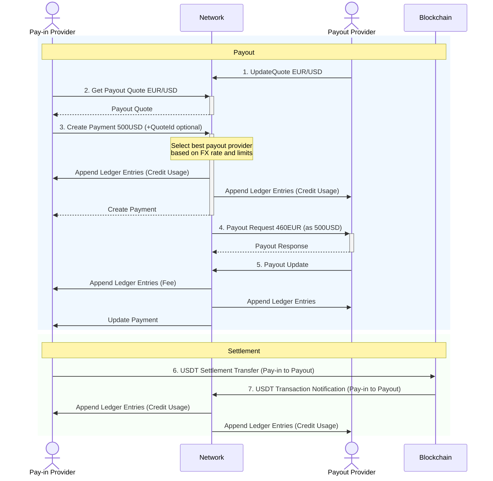

The payment processing workflow involves multiple steps and participants, requiring careful coordination between pay-in providers, payout providers, and the network orchestration layer.

## Payment Initiation
Payment processing begins when a pay-in provider calls the CreatePayment RPC method, specifying the payout currency, amount, sender details, and recipient information. The provider can optionally specify a particular quote ID obtained from a previous GetPayoutQuote call, or allow the network to find the best available quote automatically.

The network validates the payment request, checking for valid currency codes, properly formatted amounts, and complete sender and recipient information. If validation succeeds, the network searches for suitable payout providers based on the requested currency, amount, available quotes, and credit limits.

When a suitable payout provider is identified, the network reserves credit usage equal to the USD equivalent of the payout amount, ensuring that the transaction will not exceed established credit limits. This reservation mechanism prevents over-extension of credit while providing definitive payment confirmation to the pay-in provider.

## Payout Execution
Upon successful payment creation, the network calls the PayOut RPC method on the selected payout provider, providing all necessary information for payment execution including the payout amount, currency, recipient details, and payment method information.

The payout provider processes the payment according to their local procedures, which may involve bank transfers, digital wallet transactions, or other local payment methods. Throughout this process, the provider maintains reference to the payment_id and payout_id provided by the network for subsequent status reporting.

Once the payout is completed or fails, the payout provider calls the UpdatePayout RPC method to inform the network of the final payment status. Successful payouts result in the conversion of reserved credit usage to actual credit usage, while failed payouts result in the release of reserved credit and notification to the pay-in provider.

## Payment Status Management
The network maintains comprehensive payment status information throughout the entire payment lifecycle, providing real-time visibility to all participants. Pay-in providers receive status updates through the UpdatePayment RPC callback, informing them of successful payouts or failure conditions.

Failed payments trigger automatic cleanup processes, including the release of reserved credit usage and appropriate error notifications to all involved parties. This approach ensures that temporary failures do not permanently impact provider credit availability or payment capacity.

The network's status management system also supports payment tracking and reconciliation requirements, maintaining detailed transaction histories that providers can use for reporting, auditing, and customer service purposes.