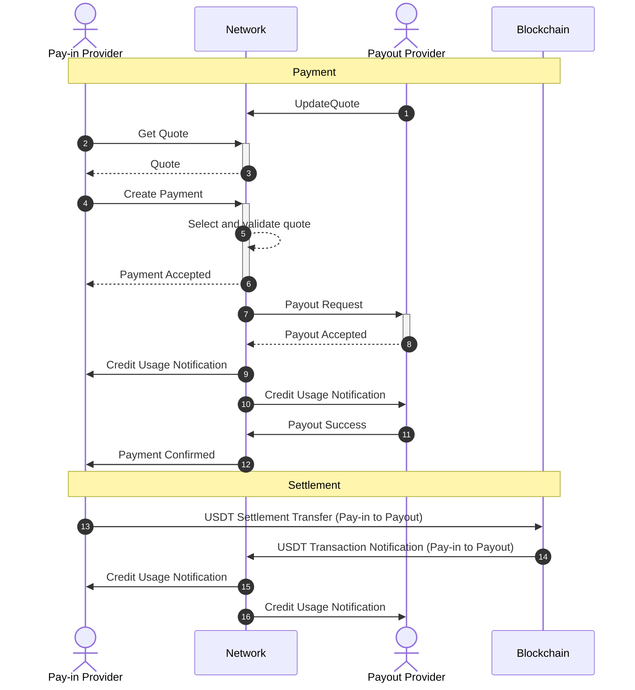

The payment processing workflow involves multiple steps and participants, requiring careful coordination between pay-in providers, payout providers, and the network orchestration layer.

## Payment Flow Description

### 1. UpdateQuote
Payout Provider streams exchange rate quotes to the Network every 5 seconds, indicating rates at which they are willing to convert USDT to local currency for payouts. Quotes include rates for all supported currencies across standard volume bands ($1K, $5K, $10K, $25K, $250K, $1M). Quotes are valid for 30 seconds. This continuous streaming serves both as a rate dissemination method and a liveness check.

### 2. Get Quote
Pay-in Provider requests a quote for a specific payment, specifying the amount (either in settlement currency USD or payout currency) and target currency. The request initiates the payment flow.

### 3. Quote Response
Network searches the order book for the best available quote that satisfies the required volume. Selection considers both rate competitiveness and available credit limit capacity between counterparties. Response includes the local currency amount, USDT settlement amount, and quote ID. Average latency: 20-50 milliseconds.

### 4. Create Payment
Pay-in Provider creates a payment using the quoted rate within the 30-second validity window. The request includes recipient details, bank account information, and comprehensive travel rule data (sender/recipient KYC information) following the OpenVASP standard with additional custom fields.

### 5. Select and Validate Quote
Network validates the quote is still valid, converts the payout amount to USD equivalent, and verifies sufficient credit limit exists between the counterparties for this transaction. If the best rate provider has insufficient credit capacity, the system automatically routes to the next best available quote.

### 6. Payment Accepted
Network confirms the payment request is accepted and will be routed to the selected Payout Provider.

### 7. Payout Request
Network sends payout instruction to the Payout Provider including: amount in local currency, USDT settlement amount, quote ID, recipient bank account details, and complete travel rule data for compliance validation.

### 8. Payout Accepted
Payout Provider responds within 30 seconds indicating acceptance or rejection. If accepted, the provider commits to completing the payout. At this moment of acceptance, settlement amounts are locked in. Provider validates travel rule data against internal AML rules and may reject if suspicious transactions are identified.

### 9. Credit Usage Notification (to Pay-in Provider)
Network increases credit usage of Pay-in Provider at Payout Provider by the USD equivalent of the payout amount. This tracks the obligation that will be settled with USDT.

### 10. Credit Usage Notification (to Payout Provider)
Network notifies Payout Provider of the increased credit usage, showing how much credit remains available for additional payments from this counterparty before settlement is required.

### 11. Payout Success
Payout Provider completes the local currency disbursement through domestic payment rails (bank transfer, IBAN, ACH, SEPA, mobile wallet, or other local payment methods) and reports completion to the Network, including payment receipt details and transaction IDs where available by local rails. Timing varies by jurisdiction: seconds for instant payment systems, up to days for traditional clearing systems.

### 12. Payment Confirmed
Network notifies Pay-in Provider that the payout has been successfully completed. Network charges both providers a fee of 5 basis points (0.05%) from the USD equivalent of the transaction amount, recorded in the accounting ledger. Total network fee is 10 basis points (0.10%) per complete transaction.

### 13. USDT Settlement Transfer
When credit usage approaches the credit limit, Pay-in Provider initiates a USDT transfer from their whitelisted wallet to the Payout Provider's whitelisted wallet on Binance Smart Chain (BSC). Settlement is not required per-payment; providers can batch multiple payments into a single settlement transaction to reduce blockchain transaction costs. Transaction is cryptographically signed by the provider's private key and submitted to public BSC nodes.

### 14. USDT Transaction Notification
Network continuously monitors BSC for transactions between whitelisted provider wallets. Any USDT transfer detected between two whitelisted addresses is automatically classified as a settlement transaction. Network waits for sufficient confirmations (typically 1-2 minutes) before considering the transaction final and irreversible.

### 15. Credit Usage Notification (to Pay-in Provider)
Network decreases the credit usage of Pay-in Provider at Payout Provider by the USDT amount of the settlement transaction. Updates internal ledger with settlement entry, allowing the Pay-in Provider to initiate additional payments.

### 16. Credit Usage Notification (to Payout Provider)
Network notifies Payout Provider that a settlement has been received, increasing available credit for future payments from this counterparty. Provider can view complete ledger history showing all payment obligations and settlements for full transparency and reconciliation.

## Payment flow notes

### Payment Initiation
Payment processing begins when a pay-in provider calls the CreatePayment RPC method, specifying the payout currency, amount, sender details, and recipient information. The provider can optionally specify a particular quote ID obtained from a previous GetPayoutQuote call, or allow the network to find the best available quote automatically.

The network validates the payment request, checking for valid currency codes, properly formatted amounts, and complete sender and recipient information. If validation succeeds, the network searches for suitable payout providers based on the requested currency, amount, available quotes, and credit limits.

When a suitable payout provider is identified, the network reserves credit usage equal to the USD equivalent of the payout amount, ensuring that the transaction will not exceed established credit limits. This reservation mechanism prevents over-extension of credit while providing definitive payment confirmation to the pay-in provider.

### Payout Execution
Upon successful payment creation, the network calls the PayOut RPC method on the selected payout provider, providing all necessary information for payment execution including the payout amount, currency, recipient details, and payment method information.

The payout provider processes the payment according to their local procedures, which may involve bank transfers, digital wallet transactions, or other local payment methods. Throughout this process, the provider maintains reference to the payment_id and payout_id provided by the network for subsequent status reporting.

Once the payout is completed or fails, the payout provider calls the UpdatePayout RPC method to inform the network of the final payment status. Successful payouts result in the conversion of reserved credit usage to actual credit usage, while failed payouts result in the release of reserved credit and notification to the pay-in provider.

### Payment Status Management
The network maintains comprehensive payment status information throughout the entire payment lifecycle, providing real-time visibility to all participants. Pay-in providers receive status updates through the UpdatePayment RPC callback, informing them of successful payouts or failure conditions.

Failed payments trigger automatic cleanup processes, including the release of reserved credit usage and appropriate error notifications to all involved parties. This approach ensures that temporary failures do not permanently impact provider credit availability or payment capacity.

The network's status management system also supports payment tracking and reconciliation requirements, maintaining detailed transaction histories that providers can use for reporting, auditing, and customer service purposes.