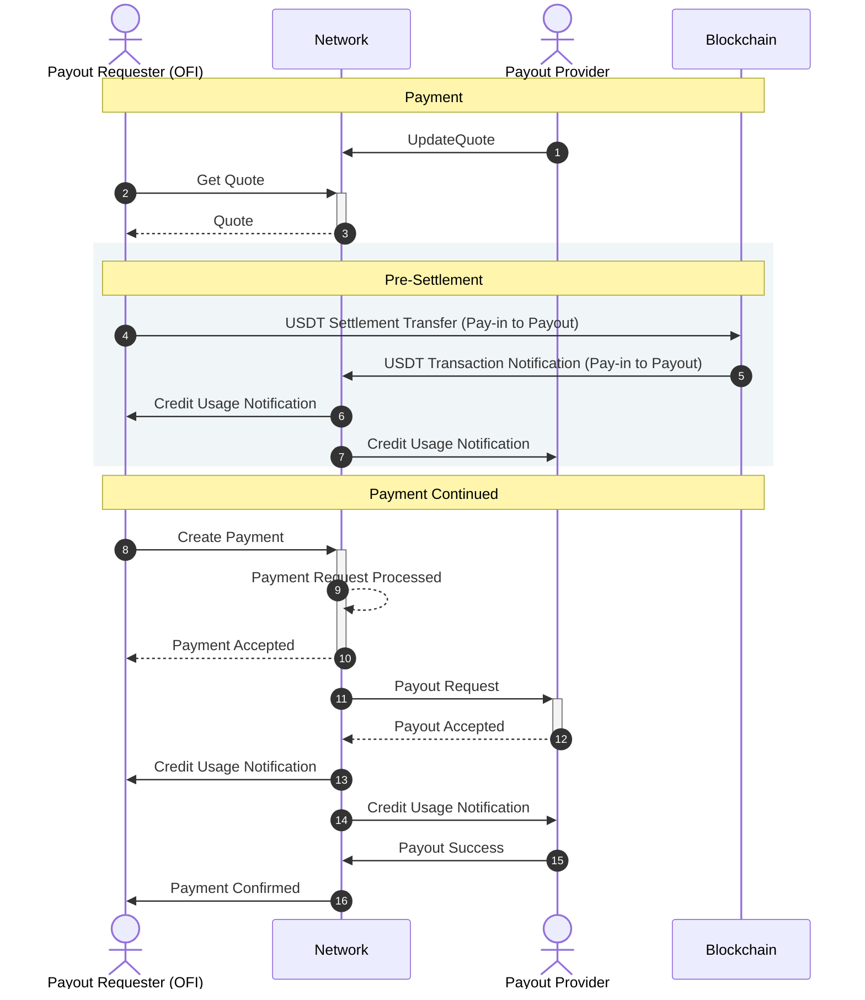

The payment processing workflow involves multiple steps and participants, requiring careful coordination between the originating financial institution (OFI) who requests the payout; the payout provider; and the network orchestration layer.

The diagram below demonstrates a payment flow using pre-settlement, the default settlement model, where USDT is sent to the payout provider before a request to pay out is made. You can [read more about settlement options here](provider-settlement).

```mermaid
sequenceDiagram
    actor PIP as Payout Requester (OFI)
    participant N as Network
    actor POP as Payout Provider
    participant BC as Blockchain

    autonumber
    Note over PIP, BC: Payment

    POP->>N: UpdateQuote
    PIP->>+N: Get Quote
    N-->>-PIP: Quote

    rect rgb(240, 246, 248)
        Note over PIP, BC: Pre-Settlement

        PIP->>BC: USDT Settlement Transfer (Pay-in to Payout)
        BC->>N: USDT Transaction Notification (Pay-in to Payout)
        N->>PIP: Credit Usage Notification
        N->>POP: Credit Usage Notification
    end

    Note over PIP, BC: Payment Continued

    PIP->>+N: Create Payment
    N-->>N: Payment Request Processed
    N-->>-PIP: Payment Accepted

    N->>+POP: Payout Request
    POP-->>-N: Payout Accepted

    N->>PIP: Credit Usage Notification
    N->>POP: Credit Usage Notification

    POP->>N: Payout Success
    N->>PIP: Payment Confirmed
```

&nbsp;

## Payment Flow Description

### 1. UpdateQuote
Payout Provider streams pay-out quotes to the Network, indicating rates at which they will convert USD to local currency for payouts. Quotes cover supported currencies across standard volume bands ($1K, $5K, $10K, $25K, $250K, $1M). The provider picks the cadence and sets each quote's `expiration`; continuous streaming keeps rates fresh and doubles as a liveness signal. See [Quote management](../quote-management) for the publishing contract.

### 2. Get Quote
OFI requests a quote for a specific payment, specifying the amount (either in settlement currency USD or payout currency) and target currency. The request initiates the payment flow.

### 3. Quote Response
Network searches the order book for the best available quote that satisfies the required volume. Selection considers both rate competitiveness and available credit limit capacity between counterparties. Response includes the local currency amount, USD settlement amount, and quote ID. Average latency: 20-50 milliseconds.

### 4. USDT Settlement Transfer
The OFI initiates a USDT transfer from their whitelisted wallet to the Payout Provider's whitelisted wallet on a supported blockchain. Settlement is not required per-payment; providers can batch multiple payments into a single settlement transaction to reduce blockchain transaction costs. 

### 5. USDT Transaction Notification
Network continuously monitors supported blockchains for transactions between whitelisted provider wallets. Any USDT transfer detected between two whitelisted addresses is automatically classified as a settlement transaction. Network waits for sufficient confirmations (typically 1-2 minutes) before considering the transaction complete.

### 6. Credit Usage Notification (to OFI)
Network increases the available credit of OFI at Payout Provider by the USDT amount of the settlement transaction. Updates internal ledger with settlement entry.

### 7. Credit Usage Notification (to Payout Provider)
Network notifies Payout Provider that a settlement has been received, increasing available credit for future payments from this counterparty. Through these notifications, providers can maintain a complete ledger history, all payment obligations and settlements, for full transparency and reconciliation.

### 8. Create Payment
OFI creates a payment, specifying the payout currency, amount, recipient details, and travel rule data (sender/recipient KYC information) following the OpenVASP IVMS101 standard with additional custom fields. The provider may include a quote ID from a previous GetQuote call to lock in a specific rate, or omit it to let the Network select the best available quote automatically.

### 9. Payment Request Processed
If a quote ID was provided, the Network validates that the quote is still within its validity window and that the specified counterparty has sufficient credit capacity. If either condition fails, the payment is rejected.
If no quote ID was provided, the Network selects the best available quote based on rate competitiveness and credit capacity. 

### 10. Payment Accepted
Network confirms the payment request is accepted and will be routed to the selected Payout Provider.

### 11. Payout Request
Network sends payout instruction to the Payout Provider including: amount in local currency, USD settlement amount, quote ID, recipient bank account details, and complete travel rule data for compliance validation.

### 12. Payout Accepted
Payout Provider responds within 30 seconds indicating acceptance or rejection. If accepted, the provider commits to completing the payout. At this moment of acceptance, settlement amounts are locked in. Provider validates travel rule data against internal AML rules and may reject if suspicious transactions are identified.

### 13. Credit Usage Notification (to OFI)
Network decreases the available credit of the OFI at Payout Provider by the USD equivalent of the payout amount.

### 14. Credit Usage Notification (to Payout Provider)
Network notifies Payout Provider of the decreased available credit, showing how much credit remains available for additional payments from this OFI.

### 15. Payout Success
Payout Provider completes the local currency disbursement through domestic payment rails and reports completion to the Network, including payment receipt details and transaction IDs where available by local rails. Timing varies by jurisdiction: seconds for instant payment systems, up to days for traditional clearing systems.

### 16. Payment Confirmed
Network notifies OFI that the payout has been successfully completed. Network charges the payout provider a fee based on the USD equivalent of the transaction amount, recorded in the accounting ledger. This fee is paid separately on a periodic basis.

## Payment flow notes

### Payment Initiation
Payment processing begins when an OFI calls the CreatePayment RPC method, specifying the payout currency, amount, sender details, and recipient information. The provider can optionally specify a particular quote ID obtained from a previous GetPayoutQuote call, or allow the network to find the best available quote automatically.

The network validates the payment request, checking for valid currency codes, properly formatted amounts, and complete sender and recipient information. If validation succeeds, the network searches for suitable payout providers based on the requested currency, amount, available quotes, and credit limits.

When a suitable payout provider is identified, the network reserves credit usage equal to the USD equivalent of the payout amount, ensuring that the transaction will not exceed established credit limits. This reservation mechanism prevents over-extension of credit while providing definitive payment confirmation to the OFI.

### Payout Execution
Upon successful payment creation, the network calls the PayOut RPC method on the selected payout provider, providing all necessary information for payment execution including the payout amount, currency, recipient details, and payment method information.

The payout provider processes the payment according to their local procedures, which may involve bank transfers, digital wallet transactions, or other local payment methods. Throughout this process, the provider maintains reference to the payment_id and payout_id provided by the network for subsequent status reporting.

Once the payout is completed or fails, the payout provider calls the UpdatePayout RPC method to inform the network of the final payment status. Successful payouts result in the conversion of reserved credit usage to actual credit usage, while failed payouts result in the release of reserved credit and notification to the OFI.

### Payment Status Management
The network maintains comprehensive payment status information throughout the entire payment lifecycle, providing real-time visibility to all participants. Pay-in providers receive status updates through the UpdatePayment RPC callback, informing them of successful payouts or failure conditions.

Failed payments trigger automatic cleanup processes, including the release of reserved credit usage and appropriate error notifications to all involved parties. This approach ensures that temporary failures do not permanently impact provider credit availability or payment capacity.

The network's status management system also supports payment tracking and reconciliation requirements, maintaining detailed transaction histories that providers can use for reporting, auditing, and customer service purposes.