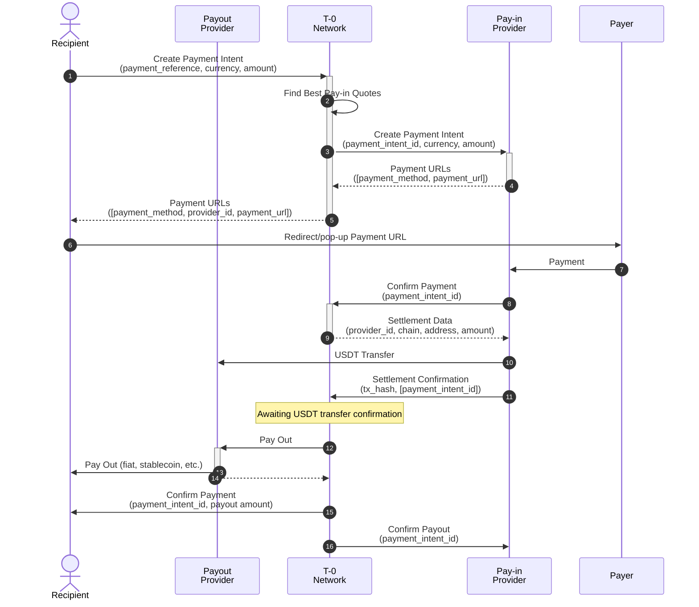

The Payment Intent flow enables merchants to accept payments from customers in other countries while avoiding high currency conversion and money transfer costs. This streamlined process facilitates cross-border transactions through the T-0 Network's distributed payment infrastructure.
Overview

The T-0 Network orchestrates cross-border payments by connecting pay-in providers (who collect local currency from payers) with payout providers (who disburse funds to recipients in their local currency). The network eliminates the need for traditional correspondent banking relationships and reduces settlement times from days to seconds.

### Key Benefits
* Reduced counterparty risk through frequent settlement between providers
* Faster payments - seconds instead of several days compared to SWIFT transfers
* No currency exchange complexity - providers work only with their local currencies and trade USDT
* Simplified compliance - no need for providers to maintain legal entities in multiple countries

 

## Payment Initiation

The payment process begins when a recipient creates a payment intent in the T-0 Network, providing:
- **Payment reference** - unique identifier for tracking the incoming payment
- **Currency and amount** - the desired pay-in currency and transaction value
- **Payout details** - recipient's preferred payout method (e.g., bank account, digital wallet)

### Network Processing
- The network evaluates available pay-in providers based on multiple factors:
    - Pay-in quotes and exchange rates
    - Available credit limits
    - Pre-settlement capacity
- Selected pay-in providers are contacted to generate payment details and URLs by payment method
- The network returns available payment options to the recipient, including:
    - Payment methods available for each provider
    - Estimated processing quotes (noting that costs may vary by payment method, card processing typically costs more than bank transfers)

### Payment Selection
Once the recipient (or payer) selects their preferred payment method and provider, they are redirected to the corresponding payment URL to complete the transaction.

## Payment Confirmation
When a pay-in provider successfully receives payment from the payer, they must send a payment confirmation to the T-0 Network. The network response includes essential settlement details which can be used for the pre-settlement scenario:
* Target blockchain network
* On-chain wallet address
* Settlement amount in USDT

### Settlement Process
The pay-in provider initiates USDT settlement by transferring funds to the payout provider's blockchain address, then submits settlement confirmation to the network, including:
* Transaction hash from the blockchain
* List of associated payment intents (may contain single or multiple payment intents)

## Payout Execution
There are to approaches for payouts to Recipient: pre- and post-settlement

#### Pre-settlement 
Payouts are initiated only after the USDT transaction arrives at the payout provider's address and is confirmed on-chain. The network waits for blockchain confirmation before triggering the payout.

#### Post-settlement
Payouts are initiated immediately using available credit limits between providers, without waiting for USDT settlement. The payout provider extends credit to process the payment, and settlement occurs later to reconcile the credit usage.

#### Completion Notifications
Upon successful payout confirmation from the payout provider to the recipient, the network sends final confirmation notifications to both the pay-in provider and the original recipient, completing the payment cycle.