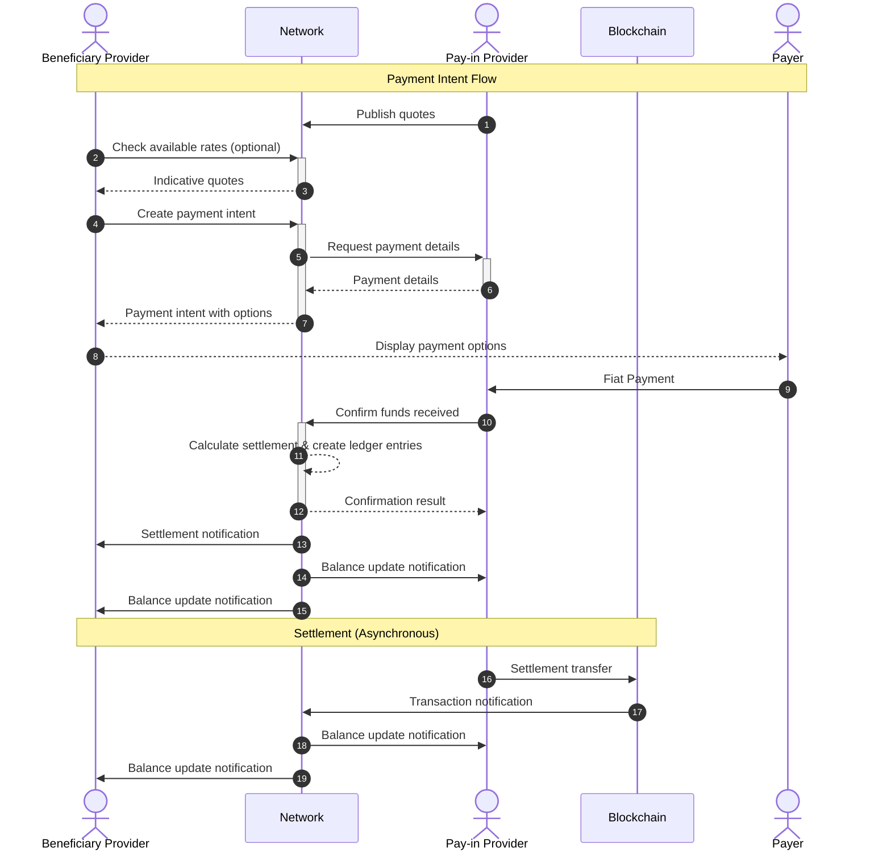

# Payment Intent

## Overview

Payment Intent enables beneficiary providers to receive fiat payments from end-users through pay-in providers, with automatic settlement tracking on the T-0 Network.

### Participants

| Role | Description |
|------|-------------|
| **Beneficiary Provider** | Creates payment intents and receives settlement. |
| **Pay-in Provider** | Receives fiat from end-users and confirms receipt. |
| **Network** | Coordinates the flow, manages quotes, and tracks settlements. |
| **Payer** | End-user making the fiat payment. |

### Flow Diagram

```mermaid
sequenceDiagram
    actor BP as Beneficiary Provider
    participant N as Network
    actor PIP as Pay-in Provider
    participant BC as Blockchain
    actor P as Payer

    autonumber
    Note over BP, P: Payment Intent Flow

    PIP->>N: Publish quotes
    BP->>+N: Check available rates (optional)
    N-->>-BP: Indicative quotes
    BP->>+N: Create payment intent
    N->>+PIP: Request payment details
    PIP-->>-N: Payment details
    N-->>-BP: Payment intent with options

    BP-->>P: Display payment options

    P->>PIP: Fiat Payment

    PIP->>+N: Confirm funds received
    N-->>N: Calculate settlement & create ledger entries
    N-->>-PIP: Confirmation result

    N->>BP: Settlement notification

    N->>PIP: Balance update notification
    N->>BP: Balance update notification

    Note over BP, BC: Settlement (Asynchronous)

    PIP->>BC: Settlement transfer
    BC->>N: Transaction notification
    N->>PIP: Balance update notification
    N->>BP: Balance update notification
```

### Flow Description

#### Phase 1: Quote Discovery (Optional)

The beneficiary provider can check available exchange rates before creating a payment intent. This helps understand which pay-in providers are available and their current rates.

Each option includes:
- Payment method (e.g., SEPA, mobile money)
- Pay-in provider identifier
- Indicative exchange rate

> **Note:** Rates are indicative only. The actual settlement rate is determined when funds are confirmed.

#### Phase 2: Create Payment Intent

The beneficiary provider creates a payment intent specifying:
- Amount and currency for the payment
- External reference for tracking
- Travel rule compliance data (beneficiary information)

The network retrieves payment details from available pay-in providers and returns the options to the beneficiary provider.

The response includes:
- `payment_intent_id` - Unique identifier to track this payment
- Available payment options with details for each supported method

#### Phase 3: End-User Payment

The beneficiary provider displays the payment options to their end-user. The end-user selects a payment method and sends fiat to the pay-in provider using the provided payment details (bank account, mobile money number, etc.).

> This step happens outside the T-0 Network.

#### Phase 4: Confirm Funds Received

When the pay-in provider receives and verifies the payment, they notify the network. The network then:
1. Selects the best available exchange rate
2. Calculates the settlement amount
3. Creates ledger entries for the settlement

#### Phase 5: Settlement Notification

The beneficiary provider receives a notification containing:
- `settlement_amount` - Amount credited to their balance
- `rate` - Exchange rate used for settlement
- `source_amount` - Fiat amount received from the end-user

After receiving this notification, the beneficiary provider can safely release goods/services to their end-user.

#### Phase 6: Settlement (Asynchronous)

Outstanding balances between providers are settled periodically via blockchain transfers. Balance update notifications keep both providers informed of their current positions.

---

## Technical Reference

### Services Overview

| Proto File | Service | Implemented By | Purpose |
|------------|---------|----------------|---------|
| `network.proto` | `PaymentIntentService` | Network | APIs for providers to interact with the network |
| `pay_in_provider.proto` | `PayInProviderService` | Pay-in Providers | Network calls to get payment details |
| `beneficiary.proto` | `BeneficiaryService` | Beneficiary Providers | Network calls to notify about payment status |

---

### PaymentIntentService (network.proto)

Called by providers to interact with the payment intent system.

#### GetQuote

Returns available indicative quotes for a given currency and amount. Use this to check rates before creating a payment intent.

**Request Fields:**

| Field | Type | Description |
|-------|------|-------------|
| `currency` | string | ISO 4217 currency code (e.g., "EUR", "GBP", "KES") |
| `amount` | Decimal | Fiat amount the end-user will pay |

**Response:**

Returns `Success` with available `quotes[]` or `QuoteNotFound` if no providers support the request.

Each `IndicativeQuote` contains:
- `payment_method` - Payment method type
- `provider_id` - Pay-in provider identifier
- `indicative_rate` - Current indicative exchange rate (USD/XXX)

> **Note:** This endpoint returns indicative quotes only, without payment details. Use `CreatePaymentIntent` to get actual payment details for making a payment.

---

#### CreatePaymentIntent

Creates a new payment intent for collecting a fiat payment.

**Request Fields:**

| Field | Type | Description |
|-------|------|-------------|
| `external_reference` | string | Provider's unique reference for idempotency |
| `currency` | string | ISO 4217 currency code |
| `amount` | Decimal | Exact fiat amount to collect |
| `travel_rule_data` | TravelRuleData | Compliance data (see below) |

**TravelRuleData Fields:**

| Field | Type | Description |
|-------|------|-------------|
| `beneficiary` | ivms101.Person[] | Beneficiary information (required, min 1) |
| `payer` | ivms101.Person | Optional payer information |

**Response:**

On success, returns:
- `payment_intent_id` - Unique identifier for this payment intent
- `pay_in_details[]` - Available payment options for the end-user

On failure, returns a reason code (e.g., `QUOTE_NOT_FOUND`).

**Idempotency:** Multiple calls with the same `external_reference` return the existing payment intent.

---

#### ConfirmFundsReceived

Called by pay-in providers to confirm receipt of funds from the end-user.

**Request Fields:**

| Field | Type | Description |
|-------|------|-------------|
| `payment_intent_id` | uint64 | The payment intent being confirmed |
| `payment_method` | PaymentMethodType | The method used by the end-user |

**Response:**

Returns `Accept` or `Reject`. On acceptance:
1. Network selects the best available quote
2. Settlement amount is calculated
3. Ledger entries are created
4. Beneficiary provider receives a notification

**Important:** This endpoint assumes full payment. Partial payments are not supported.

---

### PayInProviderService (pay_in_provider.proto)

Implemented by pay-in providers to participate in the payment intent flow.

#### GetPaymentDetails

Called by the network during payment intent creation to obtain payment details.

**Request Fields:**

| Field | Type | Description |
|-------|------|-------------|
| `payment_intent_id` | uint64 | The payment intent ID |
| `payment_methods` | PaymentMethodType[] | Methods to provide details for |
| `currency` | string | ISO 4217 currency code |
| `amount` | Decimal | Amount to be paid |
| `travel_rule` | TravelRuleData | Compliance data for this payment |

**TravelRuleData Fields:**

| Field | Type | Description |
|-------|------|-------------|
| `beneficiary` | ivms101.Person[] | Beneficiary information |
| `beneficiary_provider` | ivms101.LegalPerson | Beneficiary provider details |
| `payer` | ivms101.Person | Optional payer information |

**Response:**

Returns `payment_details[]` for each supported payment method.

**Implementation Notes:**
- Return details for methods you support; omit unsupported methods
- Include reference numbers needed to identify incoming payments
- Monitor for incoming payments and call `ConfirmFundsReceived` when received

---

### BeneficiaryService (beneficiary.proto)

Implemented by beneficiary providers to receive payment status notifications.

#### PaymentIntentUpdate

Notifies the beneficiary provider of payment intent status changes.

**Request Fields:**

| Field | Type | Description |
|-------|------|-------------|
| `payment_intent_id` | uint64 | The payment intent ID |
| `funds_received` | FundsReceived | Settlement notification (oneof) |

**FundsReceived Fields:**

| Field | Type | Description |
|-------|------|-------------|
| `settlement_amount` | Decimal | Amount credited to your balance |
| `rate` | Decimal | Exchange rate used for settlement |
| `source_amount` | Decimal | Fiat amount received from end-user |

**Response:**

Empty response indicates successful processing. Return an error status if processing failed and retry is needed.

**Idempotency:** This endpoint must be idempotent. The network may retry delivery on failures.

---

### Error Handling

| Scenario | Response |
|----------|----------|
| No quotes available | `CreatePaymentIntentResponse.Failure(QUOTE_NOT_FOUND)` |
| Invalid payment intent | Error response on `ConfirmFundsReceived` |
| Credit limit exceeded | `ConfirmFundsReceivedResponse.Reject` (future) |

---

### Idempotency

All endpoints are idempotent:

| Endpoint | Idempotency Key | Behavior |
|----------|-----------------|----------|
| `CreatePaymentIntent` | `external_reference` | Returns existing payment intent if already created |
| `ConfirmFundsReceived` | `payment_intent_id` + `payment_method` | Safe to retry |
| `PaymentIntentUpdate` | `payment_intent_id` | May be delivered multiple times |

Beneficiary providers must implement idempotent handling for `PaymentIntentUpdate` notifications.
